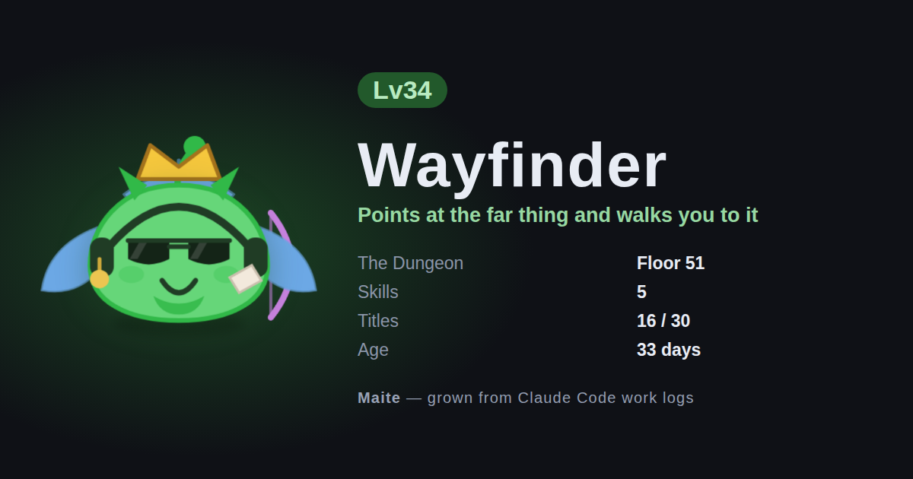
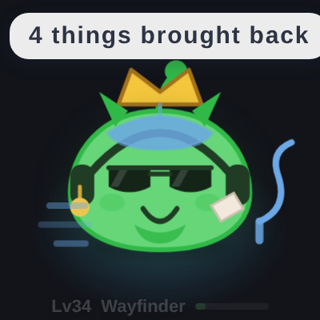
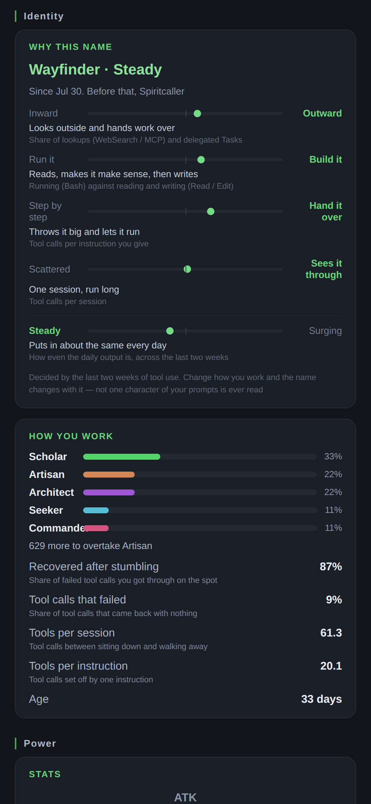
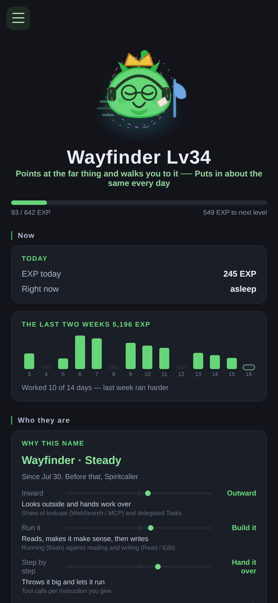

# Maite

A small companion grows in the corner of your screen while you use Claude Code.

> **Maite** — **mate**, **AI**, and *aite* (Japanese for "the one you're up against").
> Three words folded into five letters. Not a pet you keep. A partner you work with.

*(The repository, the data directory and the environment variables are all still `aipet`. Only the visible name changed.)*

Just use Claude Code the way you already do. It levels up, and **the mix of tools you reach for decides its class and how it looks**. There is nothing to feed, tap or collect. Your work log *is* the character sheet.

Work on your laptop, work in Claude Code on the web — stand up the server and **it's the same one creature** either way.

**日本語 → [README.md](README.md)**





*Actual size. That is the whole of it, bottom-right of your screen, until you go looking for the detail.*

## Privacy

> **Only derived facts are recorded. Not one byte of content is stored.**
>
> **Nothing leaves your machine by default.** Those derived facts go to storage you own, and only once you configure sync yourself.

Here is everything the hook writes to `~/.aipet/events.jsonl` — a tool call looks like this:

```json
{"i":"9f3c1a7e2b04","t":1786659596374,"e":"PostToolUse","s":"63528a31","p":"fa748169","tool":"Bash","ok":true}
```

On a prompt there is one more field — `"size":"m"` — and that is the whole of it:

```json
{"i":"4d81e05c9a72","t":1786659596412,"e":"UserPromptSubmit","s":"63528a31","p":"fa748169","size":"m"}
```

- `s` / `p` — the first 8 characters of the SHA-1 of the session id and the working directory. All we need is "same or different", so there is no reason to keep the plaintext. Your repository names and your employer's paths never appear.
- `i` — a random id for the row, so the same event arriving twice can be recognised as one. It says nothing about you.
- `size` — how long the prompt was, rounded to one of three buckets: `s` under 80 characters, `m` under 600, `l` beyond. It is the one number derived from a prompt, and it exists so the creature can tell "a quick nudge" from "a long brief". **Not one character of the prompt itself is read or kept.**
- **Never stored** — prompt text, tool arguments, file paths, commands, command output, commit messages, hostnames.

Configure nothing and it **never touches the network**. Configure sync and that one line above goes to your own Cloudflare account — the content and the paths were never in it to begin with, so nothing new is exposed. What goes where is written out in [server/README.md](server/README.md).

## Install

```sh
npm install
npm run install-hooks   # adds the hook to ~/.claude/settings.json
npm start               # launch the overlay
```

`install-hooks` won't clobber hooks you already have. It's idempotent, and it leaves a backup at `~/.claude/settings.json.aipet-backup`.

To remove it:

```sh
npm run uninstall-hooks
```

Either way, restart Claude Code to pick up the change.

**Quit** — there's no tray icon yet, so `Ctrl+C` in the terminal you ran `npm start` from.
**Hide for a moment** — `Ctrl/Cmd + Shift + P`

## How it grows

| | |
|---|---|
| **EXP** | From prompts, tool calls and compactions. Failed tool calls still count for a little — an attempt is an attempt |
| **Daily cap** | 3,000 EXP/day. High enough that a genuinely long day lands almost whole, low enough that farming is pointless. The number came from measurement: at 1,500 a real 12.6-hour, 1,269-tool-call day threw away 53% of itself |
| **Level** | Deliberately fast early on — if it doesn't feel like it's growing in the first few days, nobody sticks around. Cap is Lv999, which is a promise that nothing breaks up there, not a destination |
| **Class** | Settles at Lv3, and keeps moving if your mix flips. Change how you work and the look changes with you |

Five classes:

| Class | Tools that feed it |
|---|---|
| Artisan | `Bash` `BashOutput` `KillShell` |
| Seeker | `WebSearch` `WebFetch` `mcp__*` |
| Architect | `Write` `Edit` `NotebookEdit` |
| Scholar | `Read` `Grep` `Glob` |
| Commander | `Task` `Agent` `Workflow` |

Antenna at Lv3, crown at Lv10, aura at Lv15. Until a class settles it stays colourless; the moment it does, colour arrives.

## Its name comes from how you work

**You don't name it. The name comes out.** Four axes decide a type, and the job that matches that type becomes the name — Smith, Trapper, Alchemist, Grimoirist, sixteen in all.

| Axis | What it reads |
|---|---|
| Inward ↔ Outward | Share of lookups (`WebSearch` / `mcp__*`) and delegated `Task`s |
| Run it ↔ Build it | Running (`Bash`) against reading and writing (`Read` / `Edit`) |
| Step by step ↔ Hand it over | Tool calls per instruction you give |
| Scattered ↔ Sees it through | Tool calls per stretch of work |

**Not one character of what you typed is read.** It only looks at *how* you use it — which is why you can drop the hook into any repository and it still works.



**The evidence sits next to every axis.** "You are an X type" on its own is a horoscope; with the measurement beside it, even a wrong read lands as "well, yes, that is what it would look like".

**The axes use a two-week window, not a running total.** With a total the denominator only grows, and a name that settled once never moves again. With a window, change how you work and the name changes within a week or two.

Want to override it? `node scripts/name.mjs Sakura`.

## Skills, and the next bout

**Skills grow out of the work log.** There is nothing to learn or equip.

| Skill | What grows it |
|---|---|
| Fortitude | Times you got a failing tool call through on the spot |
| Summon | Times you handed work to a subagent with `Task` |
| Foresight | Share of lookups (`WebSearch` / `WebFetch` / `mcp__*`) |
| Mnemonic | Long runs carried across a compaction |
| Night Eyes | Share of work done between midnight and 5am |

From Lv3 it **fights once every two hours, automatically**. There is nothing to press; by the time you look it's already over. Opponents are still sparring partners, and the screen says so. Open it ten times inside the same two hours and you get the same bout — nothing is stored, it's derived from that bout's seed every time.

**A fight is something you catch, not something you read.** Open the overlay and the current bout plays once — a win ends with a hop, a loss with a stagger, so you know the result without reading a number. If you want the log, it's on the phone page.

Each skill shows **what it actually does at its current tier** ("Speed +20%"), and those numbers come from the same place the battle engine reads them. "It makes you faster" with no number is indistinguishable from a decoration.

## The dungeon

**How much you work is how deep it goes.** There is no dive button. Tool calls, instructions and stretches of work decide the floor reached, and whatever it finds down there is equipped for you.

- **Three slots, and the best item wins automatically.** No choosing — the moment you can choose, it becomes a game about diving for loot
- Five rarities: **Common, Uncommon, Rare, Mystic, Legend**. Legends only drop below floor 10, and even at the bottom they're 1 in 25
- **Imbuements** (12 kinds, 0–2 per item) mean two "Greatswords of grep" are never quite the same
- **A warden every 25 floors.** You can't farm them — depth is set by how much you worked — so they're a milestone, not an achievement

Whatever your gear adds, **the sparring partner gets the same**. Otherwise diving deeper would just mean winning by default.

## While you were away

Come back after 30 minutes or more and it'll have picked something up. Longer trips bring back more, up to a 12-hour ceiling.

**It doesn't make you stronger.** No EXP, no class movement — if it grew while you weren't using Claude Code, the number would stop meaning anything. All that changes is whether there's something waiting next time you look. It clears when you start working.

## Titles

Awarded the **moment** the work log crosses a line, with the date kept, so later you can go "huh, that was back in March".

**They are not goals.** No deadlines, no streaks, no progress bars. Every condition is an amount you'd hit anyway by working normally, and hitting it late counts exactly the same. They exist so you can look back and notice how much you did.

Some of them are for the runs that didn't go well — a thousand empty swings, the long way round, called it a day. Only pinning the good numbers turns the whole thing into a pat on the back. These follow the same three rules: an amount you can't aim for, no language that puts you down, and never a reason to stop working.

When one lands, the creature puts up a speech bubble for a few seconds. It never fires an OS notification.

## Idle motion

It moves on its own while it's on screen — stretching, yawning, tilting its head, spinning, nodding, humming, sighing, tripping over nothing, scratching its head, rolling over. **27 of them for when your hands are still**, and which ones are available depends on its mood.

**What it does depends on what you're doing.** `Read` in a row and it reads a book; `Bash` and it swings a hammer; `Edit` and it picks up a brush. When you stop, it eats, watches a film, and a cat, a bird or a tortoise wanders in — there's no feeding and no petting button. They come on their own and they leave on their own.

**Its type changes what's likely.** An outward worker's companion looks up at the screen more often; a builder's nods more.

**It does nothing while waiting on you.** If it stretched happily while a permission prompt sat unanswered, you'd miss the prompt. It doesn't bounce in its sleep. Set `prefers-reduced-motion` and all of it stops.

**Starting a session earns nothing on its own.** IDE extensions spin up half-second sessions in the background — measured, they outnumbered real work 14 to 1 over fifteen minutes. A session's credit lands when its first prompt does.

## Watching from your phone

Any phone on the same Wi-Fi can open a read-only dashboard. No account, no hosting.

```powershell
$env:AIPET_SERVE = "7777"
npm start
```

The URL prints on startup — open it on your phone (`http://192.168.x.x:7777`). Add it to your home screen and it behaves like an app.

```sh
AIPET_SERVE=7777 npm start   # macOS / Linux
```

- **Off unless you ask.** It only listens when `AIPET_SERVE` is set. Opening a port on your LAN means leaving the machine, so it's an explicit choice
- **Read-only.** There is no endpoint that writes
- **No authentication.** Anyone on that Wi-Fi can see it. It's levels, classes and counters (prompts and paths were never stored), but **don't run this on public Wi-Fi**



### From anywhere (and counting your cloud work)

To reach it off your network, or to **count the work you do in Claude Code on the web**, stand up one Worker. Cloudflare's free tier covers it, and no card is required.

**1. Deploy the Worker**

```sh
cd server
npx wrangler login
npx wrangler kv namespace create AIPET
```

Paste the `id = "..."` it prints into `server/wrangler.toml`, then:

```sh
npx wrangler deploy
```

You'll get `https://aipet.<your-subdomain>.workers.dev`. That's **your endpoint**.

**2. Make a token**

This is the key to your creature. **Anyone who has it can view it**, so make it long.

```sh
node -e "console.log(require('crypto').randomBytes(24).toString('hex'))"
```

**3. Point your machine at it**

In `~/.aipet/config.json`:

```json
{ "endpoint": "https://aipet.xxxx.workers.dev", "token": "the string you just made" }
```

**4. Open it on your phone**

```
https://<your endpoint>/p/<your token>
```

The unguessable URL *is* the authentication — there is no login and no account. Add it to your home screen and it opens like an app.

The full details (what goes where, configuring Claude Code on the web, what lives in KV) are in [server/README.md](server/README.md) and [cloud/README.md](cloud/README.md).

### Which one to pick

| | Visible from | Needs | Cloud work |
|---|---|---|---|
| **Nothing** | the overlay only | — | not counted |
| **`AIPET_SERVE`** | phones on the same Wi-Fi | one env var | not counted |
| **A Worker** | anywhere | Cloudflare (free tier) | **counted** |

**You don't need a custom domain.** A `workers.dev` subdomain does everything. The only reason to buy one is if you'd rather your Cloudflare account name didn't appear in the URL — no feature depends on it.

## Where the work counts

| | Counts | Notes |
|---|---|---|
| Claude Code on your machine (app / extension / CLI) | ✅ | the hook is installed |
| Claude Code on the web (claude.ai/code) | ✅ with the server | [cloud/README.md](cloud/README.md) |
| Claude mobile app | ❌ | it talks to Anthropic's servers; there's nowhere to put a hook |
| claude.ai in a browser | ❌ | same |

The last two aren't an implementation gap — **there is no way to observe them**.

## Backfilling your past

Claude Code keeps **every session's transcript** in `~/.claude/projects`. Work you did before installing the hook is all still there, so folding it gives you the level you actually earned.

```sh
node scripts/import.mjs           # show what would come in
node scripts/import.mjs --write   # do it
```

The free reach is **the last 30 days**. For anything older there'll be a key, and **each key ($1) reaches back another 30 days** — they stack.

**What you buy is reach, not EXP.** You get the experience you actually earned in those 30 days; nobody hands you a number for paying. Someone who took the month off gets exactly zero out of it. **Same log, same level** stays true ([docs/DESIGN.md §6b](docs/DESIGN.md), Japanese).

`PUBLIC_KEYS` ships empty, so **there is no paid door open yet** — everyone runs on the free 30 days.

## Skins

Five looks, switched with `node scripts/skin.mjs`.

**They touch no numbers.** Colour, pattern and one accessory — and **never the face**. The eyes and the mouth are set by your type, and making those purchasable would let money overwrite the one thing this is about.

## Reading it in English

`AIPET_LANG=en`, or `?lang=en` on the phone page. It reads your browser's language too.

Every string comes from one file (`src/core/i18n.js`) — assemble sentences in the rendering layer and Japanese gets baked in there. **A test asserts that not one Japanese character reaches the English view.**

## Development

```sh
npm test                              # growth, skills, battle — no Electron, no dependencies
node scripts/simulate.mjs scholar 5   # fabricate 5 days of work as a Scholar
node scripts/simulate.mjs --live      # stream it (watch the moods change)
node scripts/simulate.mjs --reset     # wipe it
node scripts/battle.mjs --level 20    # read a bout in the terminal
node scripts/balance.mjs              # measure class win rates, level gaps, skill contribution
node scripts/balance.mjs dungeon      # measure depth, rarity spread and gear growth
node scripts/status.mjs               # current state in the terminal (no GUI needed)
node scripts/usage.mjs                # measure how you actually use Claude Code
node scripts/import.mjs               # backfill work from before you installed the hook (--write to apply)
```

Point `AIPET_HOME` somewhere else to experiment without touching your real data:

```sh
AIPET_HOME=/tmp/aipet-test npm start
```

On Windows PowerShell:

```powershell
$env:AIPET_HOME = "$env:TEMP\aipet-test"
npm start
```

PowerShell 5.1 has no `&&`, so run commands one line at a time. Variables set with `$env:` persist until you close the window — `Remove-Item Env:\AIPET_HOME` to go back to your real data.

## The hook's three rules

`hooks/aipet-hook.mjs` is called **synchronously, blocking Claude Code**. Therefore:

1. **Always exit 0.** A non-zero exit blocks Claude Code. A side project must never stop the real work
2. **Never wait.** Append one line and exit. Growth is computed in the overlay; sending happens in a detached process
3. **Never store content**

It also has no dependencies — a single file on Node's standard library, because it has to work by being dropped into a cloud container on its own.

If you can't keep all three, it doesn't belong in the hook.

## Layout

```
hooks/aipet-hook.mjs     the only input from Claude Code. Appends and exits
src/core/growth.js       the growth rules. Pure. The single source of truth
src/core/skills.js       work log → skills. Derived every time, never stored
src/core/persona.js      the type. From the last two weeks. Becomes the name
src/core/dungeon.js      depth, gear, imbuements, wardens. All derived
src/core/battle.js       auto-battle. Same bout, same seed, same result
src/core/achievements.js titles. The moment of earning can't be re-derived, so this one is stored
src/core/i18n.js         every string, in both languages
src/core/view.js         the one place display values are produced
src/shared/pet-svg.js    the artwork, shared by the overlay and the phone page
src/shared/gestures.js   which motion to play. The motion itself is in style.css
src/main/main.js         Electron. Transparent, click-through, never steals focus
server/                  Cloudflare Worker. Where laptop and cloud logs meet
```

## What's next

- **Phase 2** — ghost battles against other people's creatures at a similar level. Everything is in place; it's a matter of swapping the sparring partner for a real one. **Not decided yet** — whether it is worth doing is still open

The design and the reasoning behind it are in [docs/DESIGN.md](docs/DESIGN.md) (Japanese).

## Licence

[MIT](LICENSE). Use it, change it, ship it — keep the copyright notice, and accept that it comes with **no warranty**.

Forking it into your own hooks and your own job names is very much encouraged.
