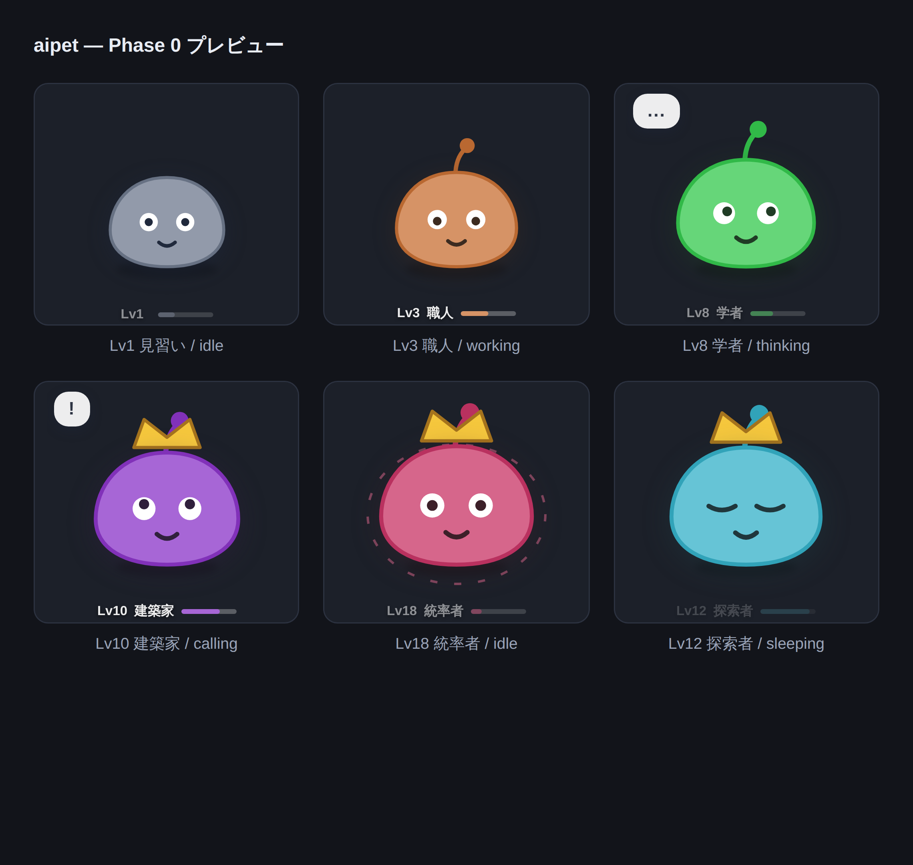
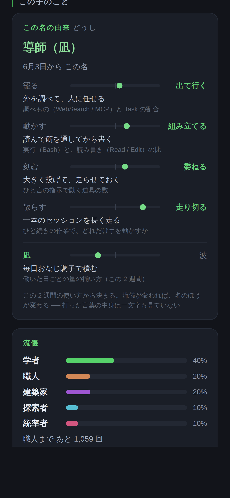
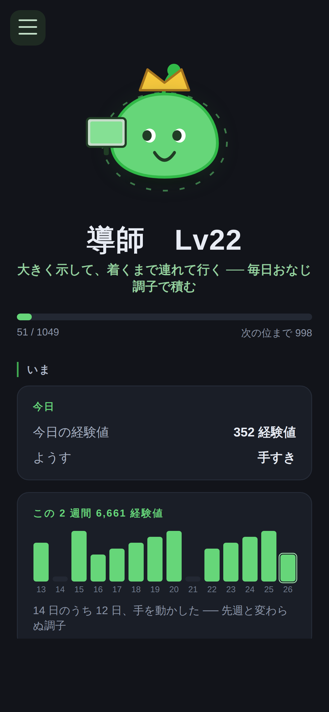

# Maite

Claude Code を使っていると、画面の隅で小さい相棒が育つ。

> **Maite**（メイト）── **mate**（相棒）と **AI**、そして **aite**（相手）。
> 3 つが同じ 5 文字に重なっている。飼うものではなく、**組んでいる相手**。

*（リポジトリ名・データ置き場・環境変数は `aipet` のまま。名前は表に出るところだけ）*

**English → [README.md](README.md)**

普段どおりに Claude Code を使うだけでレベルが上がり、**使ったツールの分布から系統（クラス）が決まって見た目が変わる**。育成のための操作は一切ない。作業ログがそのまま個性になる。

PC で作業しても、クラウドの Claude Code で作業しても、サーバーを立てれば**同じ 1 匹**が育つ。



## プライバシー

> **記録するのは「何が起きたか」の派生値だけ。中身は 1 バイトも保存しない。**
>
> **既定では機械の外に出ない。** サーバー同期を設定したときだけ、この派生値が自分の置き場に送られる。

hook が `~/.aipet/events.jsonl` に書くのはこれだけ：

```json
{"t":1786659596374,"e":"PostToolUse","s":"63528a31","p":"fa748169","tool":"Bash","ok":true}
```

- `s` / `p` … セッション ID と作業ディレクトリの **SHA-1 先頭 8 文字**。「別物かどうか」だけ分かればいいので平文で持たない。リポジトリ名も職場のパスも残らない。
- 保存**しない**もの … プロンプト本文、ツールの引数、ファイルパス、コマンド、実行結果、コミットメッセージ、ホスト名。

設定しなければ**ネットワークに一切触らない**。同期を設定すると、上の 1 行がそのまま自分の Cloudflare に送られる（本文もパスも元から入っていないので、送る内容も変わらない）。何がどこへ出るかは [server/README.md](server/README.md)。

## 入れる

```sh
npm install
npm run install-hooks   # ~/.claude/settings.json に hook を差し込む
npm start               # オーバーレイを起動
```

`install-hooks` は既存の hook 設定を壊さない。何度実行しても同じ結果になるし、`~/.claude/settings.json.aipet-backup` にバックアップも残る。

外すとき：

```sh
npm run uninstall-hooks
```

どちらも Claude Code の再起動で反映される。

**終了**：Phase 0 ではタスクトレイをまだ作っていないので、`npm start` したターミナルで `Ctrl+C`。
**一時的に隠す**：`Ctrl/Cmd + Shift + P`

## 育ち方

| | |
|---|---|
| **EXP** | プロンプト送信・ツール呼び出し・compact で入る。失敗したツール呼び出しでも少し入る（試行は試行）|
| **日次上限** | 3,000 EXP / 日。ファーミングを潰しつつ、よく働いた 1 日はほぼ丸ごと拾える高さにしてある（実測で決めた ── 1,500 のときは「12.6 時間・ツール 1,269 回」の日の 53% を捨てていた）|
| **レベル** | 序盤を意図的に速くしてある。「育ってる感」が最初の数日で来ないと続かない。上限は Lv999（届く高さではなく、ここまでは壊れないという保証） |
| **系統** | Lv3 で確定。以後も分布が逆転すれば乗り換わる ── 開発スタイルが変われば見た目も変わる |

系統は 5 つ：

| 系統 | 伸ばすツール |
|---|---|
| 職人 | `Bash` |
| 探索者 | `WebSearch` `WebFetch` `mcp__*` |
| 建築家 | `Write` `Edit` |
| 学者 | `Read` `Grep` `Glob` |
| 統率者 | `Task` |

見た目は Lv3 で触角、Lv10 で冠、Lv15 でオーラ。系統が決まるまでは無彩色で、確定した瞬間に色がつく。

## 技と、今日の一戦

**技は作業ログから生える。** 覚えさせる操作は無い。

| 技 | 生えてくる作業 |
|---|---|
| 不屈 | 失敗したツールを、その場で成功させ直した回数 |
| 召喚 | `Task` でサブエージェントに任せた回数 |
| 先読み | 調べもの（`WebSearch` / `WebFetch` / `mcp__*`）の比率 |
| 記憶術 | compact をまたいで続けた長丁場の回数 |
| 夜目 | 0〜5 時に作業した比率 |

Lv3 になると **2 時間ごとに 1 戦、自動で戦う**。操作は無く、開くともう終わっている。相手はまだ練習相手（ボット）なので、画面にもそう出る。同じ 2 時間のうちなら何度開いても同じ試合が出る（結果はどこにも保存せず、その一戦の種から毎回導出している）。

**戦闘は読むものではなく、たまに見かけるもの。** オーバーレイを開くと、その日の一戦を 1 回だけ再生する ── 勝った日は最後に跳ね、負けた日はよろけるので、数字を読まなくても結果が分かる。ログを読みたい日はスマホのページで読める。

## 名前と型 ── 働き方が、そのまま名前になる

**名前は付けるものではなく、出てくるもの。** 使い方の 4 軸から型が決まり、その型に
当たる職業がそのまま名前になる（鍛冶師・罠師・錬金術師・魔道書士 … 16 通り）。

| 軸 | 見ているもの |
|---|---|
| 籠る ↔ 出て行く | 調べもの（`WebSearch` / `mcp__*`）と `Task` の割合 |
| 動かす ↔ 組み立てる | 実行（`Bash`）と、読み書き（`Read` / `Edit`）の比 |
| 刻む ↔ 委ねる | ひと言の指示で動く道具の数 |
| 散らす ↔ 走り切る | ひと続きの作業で、どれだけ手を動かすか |

**打った言葉の中身は一文字も読んでいない。** 見ているのは「どう使っているか」だけ。
だから、どのリポジトリに置いても同じように働く。



**根拠を必ず横に置く。** 「あなたは○○型です」だけなら占いになる ── 何を見て
そう言っているかが並んでいれば、外れていても「そら そう見えるわな」で終われる。

**軸は直近 2 週間の窓で見る。** 累計にすると分母が育って、一度決まった名前が二度と
動かなくなる ── 窓なので、打ち方が変われば 1〜2 週間で名前のほうが変わる。
根拠（何を見てそう言っているか）は必ず画面に出る。無いと占いになるので。

付け替えたい人は `node scripts/name.mjs さくら`。

## 迷宮

**作業量がそのまま深さになる。** 潜る操作は無い。叩いた回数・受けた指示・
ひと続きの作業の数から到達階が出て、その階で拾ったものが勝手に装備される。

- **枠は 3 つだけで、一番強いものが自動で乗る。** 選ばせない ── 選ばせた瞬間、
  「良いものを狙って潜る」話になる
- 位は 5 段（**コモン・アンコモン・レア・ミスティック・レジェンド**）。レジェンドは
  10 階より深くでしか出ず、最深部でも 25 回に 1 回
- **宿り**（12 種 × 0〜2 個）が乗るので、同じ〈grep の大剣〉でも中身が違う
- **25 階ごとに主**がいる。狙えない（深さは作業量で決まる）ので、実績ではなく通過点

装備で乗るぶんは**練習相手にも同じだけ持たせる** ── 合わせないと、潜るほど
一方的に勝つだけになる。

## 留守のあいだに

30 分以上あけて戻ってくると、留守番のあいだに拾ってきたものが出る。長く空けるほど増えるが、12 時間で頭打ち。

**強くはならない。** EXP も系統も動かさない ── 使っていないのに強くなると、Claude Code の使用実態と切れてしまう。動くのは「次に開いたときの土産があるかどうか」だけ。作業を始めると消える。

## 実績

作業ログが条件を満たした**その瞬間**に付く。獲った日付も残るので、後から「これ、いつやったんやったか」が見られる。

**狙うものではない。** 期限も、連続日数も、進捗バーも無い。全部「普段どおり働いていれば勝手に満たされる量」にしてあって、遅れて達成しても同じように付く。振り返って「そんなに叩いたのか」と気づくためだけのもの。

獲った瞬間は、画面の隅の子が数秒だけ吹き出しを出す。OS の通知は出さない。

戦闘ログはスマホのページで読める。ターミナルで見るなら：

```sh
node scripts/battle.mjs --level 12 --skills   # 架空の Lv12 で 1 戦
node scripts/battle.mjs --days 5              # 手元の子で 5 日ぶん
```

気分は 5 つ：`working`（ツール実行中）/ `thinking`（プロンプト送信直後）/ `calling`（許可待ち・質問。見上げてくる）/ `idle` / `sleeping`。

## しぐさ

画面に出ている間、ときどき勝手に動く。伸び・あくび・首かしげ・くるっと回る・うなずく・鼻歌・ため息・つまずく・頭をかく・寝返り ── **手が空いているときだけで 28 通り**あって、そのときの気分でできることが変わる。

**何をしているかは、こちらが何をしているかで変わる。** `Read` が続けば本を読み、`Bash` が動けば金づちを叩き、`Edit` なら筆を持つ。手が止まっていれば飯を食い、映画を観て、猫や小鳥や亀が勝手に遊びに来る（餌やりも撫でるボタンも無い ── 向こうから来て勝手に帰る）。

**型で出やすさが変わる。** 外に出て行くほうの人の子はよく画面をのぞきこみ、組み立てるほうの人の子はよくうなずく。

**許可待ちのときは何もしない。** 返事を待っている子がのんきに伸びをしたら、見ている側が気づけない。寝ているあいだは跳ねない。

レベルが上がった瞬間と実績を獲った瞬間は、跳ねて数秒だけ吹き出しを出す。`prefers-reduced-motion` を指定していれば全部止まる。

**起動しただけでは EXP は入らない。** IDE 拡張などが裏で 0.5 秒で開いて閉じるセッションを大量に立てるため、実測すると 15 分で 14 対 1 の比率で実作業を圧倒していた。セッションの功績は、そのセッションに最初のプロンプトが来た時点で入る。

## スマホから見る

同じ Wi-Fi にいるスマホから、読み取り専用のダッシュボードを見られる。アカウントもサーバー契約も要らない。

```powershell
$env:AIPET_SERVE = "7777"
npm start
```

起動時にコンソールに URL が出るので、スマホのブラウザで開く（`http://192.168.x.x:7777`）。ホーム画面に追加すればアプリのように使える。

```sh
AIPET_SERVE=7777 npm start   # macOS / Linux
```

- **既定では立たない。** `AIPET_SERVE` を指定したときだけ開く。LAN に口を開けるのは「機械の外に出る」ことなので、明示的に選ばせている
- **読み取り専用。** 書き込む口が無い
- **認証は無い。** 同じ Wi-Fi にいる人には見える。中身はレベル・系統・カウンタの数値だけ（プロンプトもパスも元から保存していない）だが、**公共の Wi-Fi では立てないこと**



### 外からも見る（＋クラウドで働いたぶんも合流させる）

同じ Wi-Fi の外から見たい、**クラウドの Claude Code で作業したぶんも育てたい**、という場合はサーバーを 1 つ立てる。Cloudflare の無料枠で足りる（クレカ不要）。

**1. Worker を出す**

```
cd server
```

```
npx wrangler login
```

```
npx wrangler kv namespace create AIPET
```

出てきた `id = "..."` を `server/wrangler.toml` に貼ってから：

```
npx wrangler deploy
```

`https://aipet.<自分のサブドメイン>.workers.dev` が出てくる。これが**自分のエンドポイント**。

**2. トークンを作る**

自分のペットの鍵になる。**これを知っている人は誰でも見られる**ので、長いものを。

```
node -e "console.log(require('crypto').randomBytes(24).toString('hex'))"
```

**3. PC につなぐ**

`~/.aipet/config.json`（Windows なら `C:\Users\<名前>\.aipet\config.json`）に：

```json
{ "endpoint": "https://aipet.xxxx.workers.dev", "token": "さっき作った文字列" }
```

**4. スマホで開く**

```
https://<自分のエンドポイント>/p/<トークン>
```

推測できない URL がそのまま鍵になっている ── ログインもアカウントも作らない。**ホーム画面に追加**すればアプリのように開ける。

詳しい話（何がどこへ出るか・クラウドの Claude Code 側の設定・KV の中身）は [server/README.md](server/README.md) と [cloud/README.md](cloud/README.md)。

### どのやり方を選ぶか

| | 見られる場所 | 用意するもの | クラウドのぶん |
|---|---|---|---|
| **何もしない** | オーバーレイだけ | ── | 育たない |
| **`AIPET_SERVE`** | 同じ Wi-Fi のスマホ | 環境変数 1 つ | 育たない |
| **サーバーを立てる** | どこからでも | Cloudflare（無料枠） | **育つ** |

**独自ドメインは要らない。** `workers.dev` のサブドメインで全部動く。取るとしたら「URL に Cloudflare のアカウント名が出るのが嫌」なときだけで、機能は 1 つも変わらない。

## どこで作業すると育つのか

| | 育つ | 備考 |
|---|---|---|
| PC の Claude Code（アプリ / 拡張 / CLI） | ✅ | hook が刺さっている |
| クラウドの Claude Code（claude.ai/code） | サーバーを立てれば ✅ | [cloud/README.md](cloud/README.md) |
| スマホの Claude アプリ | ❌ | Anthropic のサーバーとやりとりするだけで、hook を刺す場所が無い |
| ブラウザの claude.ai | ❌ | 同上 |

下 2 つは実装で解ける問題ではなく、**観測する手段が存在しない**。

## 常駐させて、勝手に最新にする

クラウドの Claude Code が push したぶんを、ローカルが勝手に取り込む。

```powershell
cd C:\Users\user\aipet
powershell -ExecutionPolicy Bypass -File tools\watch.ps1 -Bridge -Restart
```

| | |
|---|---|
| `-Restart` | 取り込んだらオーバーレイを起動し直す |
| `-Deploy` | **Worker の中身が変わっていたときだけ** `wrangler deploy` する（テストが落ちた回は上げない） |
| `-Bridge` | 結果（取り込めたか・テストが通ったか）を `status/local` ブランチに push して返す |
| `-Branch` | 追いかけるブランチ。省略時はいま checkout しているもの |
| `-Interval` | 見に行く間隔（秒）。既定 60 |

### デプロイも指示でできる

`-Deploy` を付けておくと、`server/` か `src/core/` が変わった取り込みのときだけ `wrangler deploy` が走る。スマホページの HTML も CSS も Worker に焼き込まれているので、**リポジトリを取り込むだけでは Cloudflare 側は古いまま**になる ── それを自動で追いつかせるためのもの。

- README だけ直した回は走らない（変えていないものを毎回上げない）
- **テストが落ちた回は上げない**
- 結果は `status/local` の `deployed` に入る（`ok` / `failed` / `not-needed` / `blocked-by-tests`）

Cloudflare の認証は wrangler が持っているものを使う。一度 `wrangler login` してあれば、そのまま非対話で通る。

**早送り（fast-forward）できるときしか取り込まない。** 手元に未 push のコミットや編集途中のファイルがあるときは黙って見送る ── 勝手に merge して作業を巻き込むのが一番やってはいけないこと。

> **このブランチに push できる人は、あなたの PC でコードを実行できる。** 自分のリポジトリの自分のブランチだけを指すこと。

## 開発

```sh
npm test                              # 成長・スキル・戦闘のテスト（依存ゼロ・Electron 不要）
node scripts/simulate.mjs scholar 5   # 学者として 5 日ぶんの作業ログを捏造
node scripts/simulate.mjs --live      # 1 秒おきに流し続ける（気分の遷移を見る）
node scripts/simulate.mjs --reset     # 全部消す
node scripts/battle.mjs --level 20    # 戦闘ログをターミナルで読む
node scripts/balance.mjs              # 系統・レベル差・技の効きを実測する
node scripts/usage.mjs                # 手元の記録から実際の使われ方を測る
node scripts/import.mjs               # hook を入れる前の作業を遡って取り込む（--write で実行）
```

`AIPET_HOME` を指定すれば本番のデータに触らずに試せる：

```sh
AIPET_HOME=/tmp/aipet-test npm start
```

Windows（PowerShell）はこう：

```powershell
$env:AIPET_HOME = "$env:TEMP\aipet-test"
node scripts\simulate.mjs scholar 5
npm start
```

PowerShell 5.1 には `&&` が無いので、コマンドは 1 行ずつ実行する。`$env:` で設定した環境変数はそのウィンドウを閉じるまで残るので、本番データに戻すときは `Remove-Item Env:\AIPET_HOME`。

## 構造

```
hooks/aipet-hook.mjs     Claude Code からの唯一の入力口。append して即終わる
src/core/growth.js       成長のルール。純関数。ここが唯一の真実
src/core/classes.js      系統の定義
src/core/skills.js       作業ログ → 技。保存せず毎回導出する
src/core/achievements.js 実績。獲得した瞬間が要るので、ここだけ state に残す
src/core/fighter.js      state → 戦闘に出る 1 体（Phase 2 で送る形と同じ）
src/core/battle.js       オートバトル。同じ日・同じ相手なら必ず同じ結果
src/core/bots.js         練習相手。practice を必ず立てる
src/core/rng.js          決定論的な乱数。Math.random は使わない
src/core/matchup.js      系統の相性。5 系統を一本の輪にしてある
src/core/transcripts.js  Claude Code の記録 → 派生値だけのイベント
src/core/expedition.js   放置探索。保存せず、留守に入った時刻から導出する
src/core/naming.js       名前。型から出た職がそのまま名前。付け替えは設定に置く
src/core/persona.js      型。直近 2 週間の使い方から出る。そのまま名前になる
src/core/clock.js        「その人にとっての 1 日」をどこで切るか
src/core/state.js        永続化と、events.jsonl の未読分だけを読む処理
src/core/view.js         表示用に落とす変換。オーバーレイとスマホで共通
src/shared/pet-svg.js    キャラの絵。オーバーレイとスマホで共通
src/shared/gestures.js   しぐさの選び方。動き自体は style.css のキーフレーム
src/main/main.js         Electron。透明・クリック透過・フォーカスを奪わない
src/main/server.js       スマホ用のローカル HTTP サーバー（既定では立たない）
src/core/config.js       同期の設定。既定は同期しない
server/                  Cloudflare Worker。PC とクラウドの記録の合流点
cloud/                   クラウドの Claude Code に置く settings.json と手順
.claude/                 このリポジトリをクラウドで開いたとき用（cloud/ のコピー）
src/renderer/            オーバーレイの描画
src/mobile/              スマホ用ダッシュボード
scripts/install-hooks.mjs
scripts/simulate.mjs
scripts/name.mjs         名前を付け替える（付けない人は触らなくていい）
```

### hook の掟

`hooks/aipet-hook.mjs` は Claude Code に**同期でブロックして**呼ばれる。だから：

1. **絶対に exit 0**。非 0 を返すと Claude Code の動作をブロックする。おまけが本体を止めてはいけない
2. **待たない**。1 行 append して即終わる。成長の計算はオーバーレイ側、送信は切り離した別プロセス
3. **中身を保存しない**

依存も持たない。Node の標準モジュールだけで動く 1 枚ものにしてあるのは、クラウドのコンテナにこのファイルを置くだけで動く必要があるため。

3 つとも守れなくなったら、それは hook でやることではない。

## 遡って取り込む

`~/.claude/projects` に、Claude Code は**全セッションの記録をローカルに残している**。hook を入れる前の作業もそこに全部あるので、畳めば「本当に働いた通りのレベル」から始められる。

```sh
node scripts/import.mjs           # 何が入るか見るだけ
node scripts/import.mjs --write   # 実行する
```

遡れるのは**直近 30 日ぶん**。それより前も入れたい人のために鍵を用意する予定で、**鍵 1 本（1 ドル）につき、さらに 30 日ぶん遡れる**（重ねて使える）。

**買って増えるのは「見える範囲」だけ。** その 30 日に本当にやった作業ぶんの経験値が入るだけで、金額に応じて EXP が配られるわけではない ── 1 ヶ月まるごと休んでいた人が払っても、増えるのは 0。**同じログを入れたら同じレベルが出る**は崩れない（[docs/DESIGN.md §6b](docs/DESIGN.md)）。

いまは `PUBLIC_KEYS` が空なので、**課金の口はまだ開いていない**。全員が無料の 30 日で動く。

## 着替え

見た目だけのスキンが 5 つ。`node scripts/skin.mjs` で切り替える。

**数字には一切効かない。** 色・模様・小物の 3 枚しか触らず、**顔つきには触らない**
── 目つきと口元は型が決めるもので、そこを買えるようにすると「働き方が顔に出る」が
お金で上書きできてしまう。

## 英語でも読める

`AIPET_LANG=en` か、スマホなら `?lang=en`。ブラウザの言語も見る。

文言の出どころは `src/core/i18n.js` の 1 枚だけ ── 描画側で文を組み立てると、
そこに日本語が焼き付く。**英語の画面に日本語が一文字も混ざらないことを、
テストで丸ごと縛ってある。**

## この先

- **Phase 2** … 同ランク帯のユーザーとゴースト戦。練習相手を本物の個体に差し替えるだけで動くところまで来ている

設計の詳細と、その判断の理由は [docs/DESIGN.md](docs/DESIGN.md)。

## ライセンス

[MIT](LICENSE)。自由に使って、改造して、配って構わない ── 著作権表示を残すことと、
**無保証**（壊れても作者は責任を負わない）だけが条件。

フォークして自分の hook・自分の職業名に作り替えるのも歓迎する。
